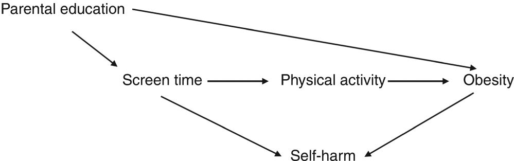

```{r 02_setup, include=FALSE}
rm(list = ls())
knitr::opts_chunk$set(echo=TRUE, eval=FALSE)
```

# Probability and DAGs

## Learning Goals {-}

1. Appreciate the importance of starting analysis from prior/expert knowledge
2. Simulate data corresponding to a causal DAG
3. Use simulations to verify the marginal/conditional independence and dependence relationships implied by DAG structures
4. Develop notions of causal and non-causal associations in the context of graphs

<br><br><br><br>

## Goal 1 {-}

In your groups, discuss your responses to the pre-class question about the figure below (which came from [this article](https://www.nature.com/articles/s41390-018-0071-3) from Nature Pediatric Research).

- What arrows do all of you agree on?
- Do you disagree on any arrows?
- If the question of interest is how screen time affects the risk of childhood obesity, what variables and arrows do you think are missing?

<center>

</center>

If you have time left, pick your favorite example of conditional independence and conditional dependence from your answers to the pre-class questions.

<br><br><br><br>

## Lead-in to R activity: Poll {-}

Navigate to:

<center>
[PollEv.com/lesliemyint417](https://www.PollEv.com/lesliemyint417)
</center>

<br><br><br><br>

## Discussion {-}

**Download [this Rmd file](template_rmds/02-probability-dags.Rmd) to start from.**

```{r}
library(ggplot2)
library(dplyr)
```

An introduction to the `rbinom` function:

```{r}
# 4 different people each flip a fair coin once
rbinom(4, size = 1, prob = 0.5)

# 4 different people flip loaded coins
# First 2 flip a coin with P(Heads) = 0.9
# Second 2 flip a coin with P(Heads) = 0.2
rbinom(4, size = 1, prob = c(0.9, 0.9, 0.2, 0.2))
```

```{r}
# Before you run this code, what will the result be?
rbinom(2, size = 1, prob = c(1, 0))
```

How can we simulate X -> Y for binary X and Y?

```{r}
# set.seed() ensures reproducible random numbers
set.seed(2020)
# Set sample size
n <- 1e5
# Generate a binary variable X for all n cases
X <- rbinom(n, size = 1, prob = 0.6)
Y <- rbinom(n, size = 1, prob = 0.6)
```

Are the X and Y we just simulated independent or dependent? Let's make a plot to see:

```{r}
# We put X and Y in a dataset using data.frame()
# They are turned into categorical variables using factor()
sim_data <- data.frame(X = factor(X), Y = factor(Y))

# Proportional bar plot
ggplot(sim_data, aes(x = X, fill = Y)) +
    geom_bar(position = "fill")
```

How can we make Y dependent on X?

```{r}
# Generate probabilities that Y=1 that depend on the value of X
p_X <- dplyr::case_when(
    X==1 ~ 0.8,
    X==0 ~ 0.2
)

# Simulate Y using p_X
Y <- rbinom(n, size = 1, prob = p_X)

# Put X, Y, and p_X into a dataset
sim_data <- data.frame(X = factor(X), Y = factor(Y), p_X = p_X)

# Check that p_X = 0.8 when X is 1
sim_data %>%
    filter(X=="1")

# Check that p_X = 0.2 when X is 0
sim_data %>%
    filter(X=="0")

# Proportional bar plot
ggplot(sim_data, aes(x = X, fill = Y)) +
    geom_bar(position = "fill")
```

How can we make a variable Z dependent on 2 causes: X and Y?

```{r}
X <- rbinom(n, size = 1, prob = 0.6)
Y <- rbinom(n, size = 1, prob = 0.6)
p_XY <- dplyr::case_when(
    X==1 & Y==1 ~ 0.8,
    X==0 & Y==1 ~ 0.2,
    X==1 & Y==0 ~ 0.7,
    X==0 & Y==0 ~ 0.4
)
Z <- rbinom(n, size = 1, prob = p_XY)

# Put X, Y, and Z into a dataset
sim_data <- data.frame(X = factor(X), Y = factor(Y), Z = factor(Z))

# If we wanted to save datasets filtered on Z (Why?)
sim_data_filt_z0 <- sim_data %>% filter(Z=="0")
sim_data_filt_z1 <- sim_data %>% filter(Z=="1")
```

<br><br>

## R Exercises {-}

### Exercise 1 {-}

Simulate data for a chain X -> Y -> Z where all variables are binary. Make plots to show the following properties:

- X and Z are marginally dependent
- X and Z are conditionally independent given Y

Describe how your simulation would change if you wanted to check the more general property of chains that two variables are conditionally independent given any variables in between them. (You don't actually need to implement this simulation but can if you have time.)

<br>

### Exercise 2 {-}

Simulate data for a fork Y <- X -> Z where all variables are binary. Make plots to show the following properties:

- Y and Z are marginally dependent
- Y and Z are conditionally independent given X

<br>

### Exercise 3 {-}

Simulate data for a collider X -> Z <- Y where all variables are binary. Make plots to show the following properties:

- X and Y are marginally independent
- X and Y are conditionally dependent given Z

Describe how your simulation would change if you wanted to check the more general property of colliders that X and Y become dependent conditional on Z and/or any descendants of Z. (You don't actually need to implement this simulation but can if you have time.)

<br><br>

## Conceptual Exercises {-}

### Exercise 4 {-}

<center>

</center>

In the causal diagram above, let X be a treament and Y be an outcome of interest.

a. What would you say are the "causal paths" between X and Y? What would you say are the "non-causal paths"?
b. Thinking about the marginal and conditional independence and dependence relations we've discussed, how might we restrict the influence of these non-causal paths?

<br>

### Exercise 5 {-}

Can you come up with a general rule that tells us when two variables will be conditionally independent given another set of variables Z? (Where it is possible that Z is an empty set containing no variables.)

Try out your rule on the causal diagram below.

<center>

</center>
