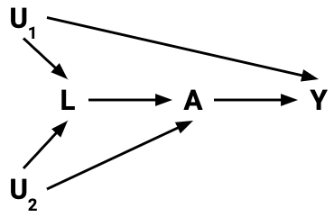

```{r 05_setup, include=FALSE}
knitr::opts_chunk$set(echo=TRUE, eval=FALSE)
```

# Estimating causal effects

## Learning Goals {-}

1. Practice constructing a causal diagram from the ground up in consultation with fellow experts
2. Extend d-separation ideas to the estimation of causal effects
3. Develop the idea of inverse probability of treatment weighting (IPW or IPTW) for causal effect estimation
4. Understand how the do-operator is related to inverse probability weighting

<br><br><br><br>

## Exercise: DAG construction {-}

**Research question:** What is the causal effect of participating in yoga once per week for 12 weeks on resting heart rate at the end of that period?

- We are trying to design an observational study that could be carried out at Macalester.

Recall our principles for constructing causal DAGs:

- A DAG is a **causal DAG** if it is **common cause-complete**: for any two variables in the DAG, common causes (whether measured or unmeasured) of those variables are shown.
- A causal DAG does **NOT** need to be **cause-complete** (infeasible due to infinite regress of causes).
- It **should** contain variables that are selected on, and subsequently common causes between those variables and existing variables.

<br><br>

**Reflect:** Write about the process of constructing the causal diagram with your colleagues.

- How did your discussions flow?
- How did you resolve (or not) any disagreements on the structure?
- Were you able to decide if your diagram was good enough? If so, how?
- What questions or concerns do you still have about this process?

<br>

**Further reading:**

- Chapter 9 of our WHATIF book (see [References]) introduces the consideration of measurement error. We won't talk about measurement error in this course but you are welcome to read about these ideas on your own.
- Chapters 6, 7, and 8 talk about causal diagrams, confounding, and selection bias. This another resource to complement PRIMER.

<br><br><br><br>

## Warm-up: d-separation {-}

Navigate to:

<center>
[PollEv.com/lesliemyint417](https://www.PollEv.com/lesliemyint417)
</center>

<br>

Slides of the causal diagrams (with solutions) are available [here](https://docs.google.com/presentation/d/1tqrHo-zAPNkQ3dVfd8AVz3xCOVGwMiubDOAtQzO4GPg/edit?usp=sharing).

<br><br><br><br>

## Discussion: Estimating causal effects {-}

In adjusting for variables in our analysis, we want to "do no harm":

- Block non-causal paths that generate unwanted associations
- Do not accidentally create non-causal paths that generate unwanted associations
- Leave causal paths (chains) alone

<br>

This was actually the rationale behind the **backdoor criterion**. (We'll get back to this soon.)


**The do-operator**

- One notion of causation is that of **intervention**: setting a variable's value
- There is a difference between $P(Y \mid A = a)$ and $P(Y \mid \hbox{do}(A = a))$.
    - $P(Y \mid A = a)$ is an observational probability
    - $P(Y \mid \hbox{do}(A = a))$ is an intervention probability
- When we intervene on $A$, this amounts to removing all arrows *into* $A$.

<center>

</center>

- The do-operator allows us to graphically simulate interventions.
- In the world that was intervened on (manipulated), what do relationships between variables look like?
- Rules of probability combined with a set of graph rules (called the **do-calculus**) allow us to relate the relationships in the manipulated graph to relationships that we observe in the real world.

$$\hbox{Average causal effect} = P(Y = y \mid \hbox{do}(A = 1) - P(Y = y \mid \hbox{do}(A = 0)$$

- $Y$ is the outcome and $A$ is the treatment (action) variable

<br><br>

Taste of do-calculus next week. For now, let's approach effect estimation from a different angle:

- The mathematical expressions in PRIMER for $P(y \mid \hbox{do}(a))$ had something in common --> let's develop this idea and relate to something familiar: d-separation

<br><br><br><br>

### Worksheet: developing ideas {-}

Worksheet (with solutions) available [here](https://docs.google.com/presentation/d/1BEK75PKWGWSmL9FxDmKLevJwPOXFsl70LtHJAnXZAko/edit?usp=sharing)


<br><br><br><br>


### Exercise: Simulation planning {-}

**Goal:** Plan (then implement) a simulation that shows that inverse probability of treatment weighting (IPTW) to estimate average causal effects gives the same results as using the do-operator. This will be done in the context of the DAG below.

```{r 05-fig-sim-plan, fig.width=6, fig.height=2, fig.align="center", echo=FALSE, eval=TRUE}
par(mar = rep(0.5,4))
plot(1, type = "n", xaxt = "n", yaxt = "n", bty = "n", xlab = "", ylab = "", xlim = c(0,6), ylim = c(1,4))
text(c("A", "Z", "Y"), x = c(1,3,5), y = c(1,4,1), cex = 1.3)
arrows(x0 = c(3,3), y0 = c(4,4)-0.2, x1 = c(1,5), y1 = c(1,1)+0.2, angle = 25, lwd = 4)
arrows(x0 = 1.7, y0 = 1, x1 = 4.5, y1 = 1, angle = 25, lwd = 4)
```

**Plan:** As you go through this planning, think about what code you would have to write (in broad terms) and the order in which you would have to run those commands. For this exercise, don't look at the code below. We'll get to it next.

- Phase 1:
    - How would you simulate the DAG below? (All variables binary.)
    - How would you simulate new versions of `Y` under the manipulated graphs resulting from `do(A = 1)` and `do(A = 0)`?
    - How would you compute the average causal effect from `do`-ing?
- Phase 2:
    - How would you estimate the propensity score for each individual?
    - How would you estimate `P(Y = 1 | do(A = 1))` and `P(Y = 1 | do(A = 0))` using those estimated propensity scores?

<br>

After your planning phase, step through the code in the section below, and make sure that you understand what each line is doing. Clarify with the instructor as needed.

<br><br><br><br>

### Simulation example {-}

A template Rmd is available [here](template_rmds/05-estimating-causal-effects.Rmd).

```{r}
library(dplyr)
```

**Phase 1:**

```{r}
set.seed(22)
n <- 1e6
Z <- rbinom(n, size = 1, prob = 0.5)
p_A <- dplyr::case_when(
    Z==1 ~ 0.8,
    Z==0 ~ 0.3
)
A <- rbinom(n, size = 1, prob = p_A)
p_Y <- dplyr::case_when(
    Z==1 & A==1 ~ 0.3,
    Z==1 & A==0 ~ 0.6,
    Z==0 & A==1 ~ 0.9,
    Z==0 & A==0 ~ 0.2
)
Y <- rbinom(n, size = 1, prob = p_Y)
A_do_1 <- rep(1, n)
A_do_0 <- rep(0, n)

p_Y_Ado1 <- dplyr::case_when(
    Z==1 & A_do_1==1 ~ 0.3,
    Z==1 & A_do_1==0 ~ 0.6,
    Z==0 & A_do_1==1 ~ 0.9,
    Z==0 & A_do_1==0 ~ 0.2
)
Y_Ado1 <- rbinom(n, size = 1, prob = p_Y_Ado1)

p_Y_Ado0 <- dplyr::case_when(
    Z==1 & A_do_0==1 ~ 0.3,
    Z==1 & A_do_0==0 ~ 0.6,
    Z==0 & A_do_0==1 ~ 0.9,
    Z==0 & A_do_0==0 ~ 0.2
)
Y_Ado0 <- rbinom(n, size = 1, prob = p_Y_Ado0)


sim_data <- data.frame(Z, A, Y, Y_Ado1, Y_Ado0)

sum(sim_data$Y_Ado1==1)/n
sum(sim_data$Y_Ado0==1)/n

(sum(sim_data$Y_Ado1==1)/n)-(sum(sim_data$Y_Ado0==1)/n)
```

**Phase 2:**

```{r}
# Fit a logistic regression model to estimate propensity scores
ps_mod <- glm(A ~ Z, data = sim_data, family = "binomial")

# Get the actual propensity scores
# predict(..., type = "response") gives the predicted probabilities from logistic regression
# What computations are going on behind the scenes?
sim_data$PS <- dplyr::case_when(
    A==1 ~ predict(ps_mod, type = "response"),
    A==0 ~ 1-predict(ps_mod, type = "response")
)

# Form inverse probability weights
sim_data$weight <- 1/sim_data$PS

# Use the IP weights to estimate:
# (1) the average outcome if all people were treated
# (2) the average outcome if all people were untreated
# group_by() forms groups according to the given variable
# summarize() computes a summary measure for those groups
results <- sim_data %>%
    group_by(A) %>%
    summarize(Y_po_estim = sum(Y*weight)/sum(weight))

# Display estimates (1) and (2)
results

# Compute the estimated average causal effect (ACE)
# How does it compare to the truth from "do"ing?
diff(results$Y_po_estim)
```

### On your own {-}

Adapt the simulation to a situation with 2 confounders `Z` and `W` as in the DAG below:

```{r 05-fig-sim-exercise, fig.width=6, fig.height=2, fig.align="center", echo=FALSE, eval=TRUE}
par(mar = rep(0.5,4))
plot(1, type = "n", xaxt = "n", yaxt = "n", bty = "n", xlab = "", ylab = "", xlim = c(0,6), ylim = c(1,4))
text(c("A", "Z", "W", "Y"), x = c(1,1.5,4.5,5), y = c(1,4,4,1), cex = 1.3)
arrows(x0 = c(1.5,1.5), y0 = c(4,4)-0.2, x1 = c(1,4.8), y1 = c(1,1)+0.2, angle = 25, lwd = 4)
arrows(x0 = c(4.5,4.5), y0 = c(4,4)-0.2, x1 = c(1.2,5), y1 = c(1,1)+0.2, angle = 25, lwd = 4)
arrows(x0 = 1.7, y0 = 1, x1 = 4.5, y1 = 1, angle = 25, lwd = 4)
```

**Note:** To simulate dependence on 3 or more variables (e.g., A depends on B, C, and D), an easier approach is to do as below:

```{r}
p_B <- dplyr::case_when(
    B==1 ~ 0.8,
    B==0 ~ 0.4
)
p_C <- dplyr::case_when(
    C==1 ~ 0.9,
    C==0 ~ 0.5
)
p_D <- dplyr::case_when(
    D==1 ~ 0.7,
    D==0 ~ 0.1
)
p_A <- p_B*p_C*p_D
```


