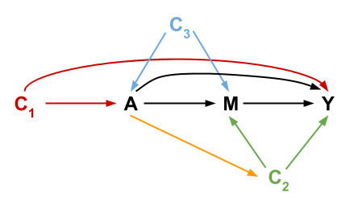

```{r 10_setup, include=FALSE}
knitr::opts_chunk$set(echo=TRUE, eval=FALSE)
```

# (PART) Mediation Analysis {-}

# Graphical Structure of Mediation

## Learning Goals {-}

1. Understand scientific motivations for mediation analysis and pose research questions that can be investigated by direct and indirect effects.
2. Describe how regression models can be used to estimate direct and indirect effects.
3. Apply d-separation ideas to understand the graphical reasoning behind the confounding assumptions needed to identify direct and indirect effects.

<br><br><br><br>

## Warm-up {-}

In your groups, discuss responses to the video questions corresponding to the Mediation Analysis video.

<br><br><br><br>

## Exercises {-}

### Background {-}

Consider the following causal diagram representing variables important in mediation analysis:



Consider the following 4 assumptions:

1. No unmeasured confounding of the treatment-outcome relationship ($A$ and $Y$).
2. No unmeasured confounding of the mediator-outcome relationship ($M$ and $Y$).
3. No unmeasured confounding of the treatment-mediator relationship ($A$ and $M$).
4. No confounder of the mediator-outcome relationship is affected by treatment (arrows from $A$ to $C_2$).

When these 4 assumptions hold, the CDE, NDE, and NIE are **identifiable**, and we can use models such as the regression models below to estimate them. ($C = \{C_1, C_2, C_3\}$)

$$ E[Y\mid A, M, C] = \theta_0 + \theta_1 A + \theta_2 M + \theta_3 AM + \mathbf{\theta_4'C} $$
$$ E[M\mid A, C] = \beta_0 + \beta_1 A + \mathbf{\beta_2'C} $$

> **Identifiability:** A quantity (here, the different direct and indirect effects) is **identifiable** if the true value is able to be learned from an infinite amount of data. In causal inference, threats to identifiability are usually the result of unmeasured variables that create undesired non-causal paths.

<br>

In the later exercises, it will be helpful to refer to the following list of paths from $A$ to $Y$:

```{r echo=FALSE, message=FALSE}
library(igraph)

# Create the edge list
el <- rbind(
    c("C1", "A"),
    c("C1", "Y"),
    c("C3", "A"),
    c("C3", "M"),
    c("A", "Y"),
    c("A", "M"),
    c("M", "Y"),
    c("A", "C2"),
    c("C2", "M"),
    c("C2", "Y")
)
# Create the graph
dag <- graph_from_edgelist(el, directed = TRUE)
plot(dag)

# Helper functions for displaying paths
display_paths <- function(g, paths) {
    adj <- as_adjacency_matrix(dag)
    for (i in seq_along(paths)) {
        path <- paths[[i]]
        cat("Path ", i, ":   ", sep = "")
        draw_edge(adj_mat = adj, path = path)
    }
}

draw_edge <- function(adj_mat, path) {
    path_ids <- as_ids(path)
    arrow_vec <- rep("", length(path_ids))
    for (i in seq_len(length(path_ids)-1)) {
        node1 <- path_ids[i]
        node2 <- path_ids[i+1]
        if (adj_mat[node1,node2]==1) {
            ## Arrow is 1 -> 2
            arrow_vec[i] <- "->"
        } else {
            ## Arrow is 1 <- 2
            arrow_vec[i] <- "<-"
        }
    }
    path_string <- paste(path_ids, arrow_vec)
    path_string <- paste(path_string, collapse = " ")
    cat(path_string, "\n")
}

display_paths(dag, all_simple_paths(dag, from = "A", to = "Y", mode = "all"))
```

<br><br>

### Exercise 1 {-}

Assumptions 1 and 2 are needed in order to identify the controlled direct effect (CDE). We will use the above DAG to understand why.

a. First argue that drawing a box around $M$ in the DAG is relevant here.
b. Using d-separation ideas, argue why Assumptions 1 and 2 must hold.
c. Using d-separation ideas, argue why it is not necessary for Assumptions 3 and 4 to hold if 1 and 2 hold.

<br><br>

### Exercise 2 {-}

In addition to Assumptions 1 and 2, Assumptions 3 and 4 are also needed to identify the natural effects (the NDE and NIE).

a. Using d-separation ideas, why must Assumption 1 still hold to identify the NDE and NIE?

b. Now let's look at Assumption 2.
    - Argue that the same d-separation reasoning from Exercise 1 applies for understanding why Assumption 2 must hold to identify the NDE.
    - The natural direct effect can be viewed as a composition of the $A$ to $M$ effect and the $M$ to $Y$ effect. Given this, why must Assumption 2 hold?

c. Now let's look at Assumption 3. How do the two natural effects differ from the controlled direct effect? Given this, why does unmeasured treatment-mediator confounding pose a concern?

Assumption 4 is harder to justify purely graphically, but if you are curious about it and the underlying proof, ask the instructor.

### Exercise 3 {-}

We can use models such as the regression models below to estimate the CDE, NDE, and NIE. ($C = \{C_1, C_2, C_3\}$, and $\theta_4, \beta_2$ are vectors of coefficients.)

$$ E[Y\mid A, M, C] = \theta_0 + \theta_1 A + \theta_2 M + \theta_3 AM + \theta_4'C $$
$$ E[M\mid A, C] = \beta_0 + \beta_1 A + \beta_2'C $$

Given these models, show that the 3 effects are given by:

- CDE: $\theta_1 + \theta_3 m$
- NDE: $\theta_1 + \theta_3 (\beta_0 + \beta_2'C)$
- NIE: $\beta_1(\theta_2 + \theta_3)$

**Note:** Next time, we'll explore how this approach generalizes to more flexible ways to estimate mediation effects.


